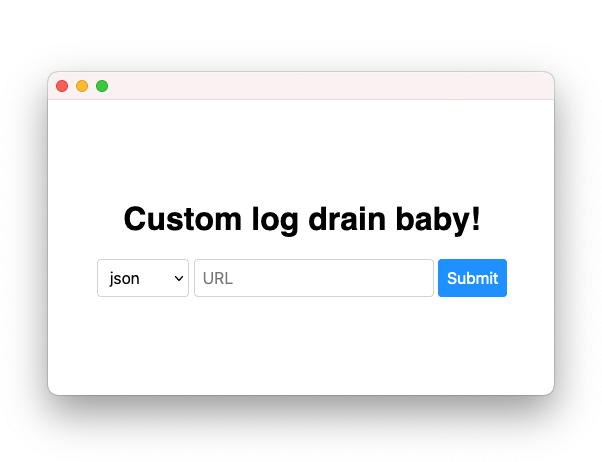

# Vercel custom log drain

> Configure a custom log drain on a Vercel app.

<div align="center">

[](https://vercel.com/integrations/custom-log-drain)

</div>

## Overview

This is the source of a [Vercel integration](https://vercel.com/docs/integrations)
that leverages the [log drains](https://vercel.com/docs/api#integrations/log-drains)
feature of the API to allow you to configure arbitrary log drains on your apps.

By default Vercel only allows you to configure [external logging services](https://vercel.com/integrations?category=logging)
like Datadog, LogDNA and more, but there's no option to manually
configure another service, which is why I wrote this.

Read more on the Vercel blog about [their implementation of log drains](https://vercel.com/blog/log-drains).

## Marketplace integration

For convenience and mostly for my personal usage, I provide a hosted
version of this integration on my own server, which you can find on the
[Vercel marketplace](https://vercel.com/integrations/custom-log-drain).

This service is provided for free and I offer no guarantee on its
availability. If [this page](https://cloud.codejam.info/vercel/callback)
responds, then it means it's up and you can use it.

The only purpose of this integration is to configure a custom log drain
for you (something that Vercel doesn't currently allow you to do). Once
installed, the actual forwarding of logs doesn't depend on this
integration at all.

As you can verify in the [source code](index.js), the app do not store
the access token (or anything whatsoever), meaning that it cannot make
API requests once the installation is completed and the log drain is
configured.

This means that in order to update a log drain URL, you need to remove
the integration and install it again.

## Log drain format

Vercel supports 3 formats: JSON, NDJSON and syslog. See the [API
documentation](https://vercel.com/docs/api#integrations/log-drains/format-and-transport)
for more details.

## Hosting this integration

This will guide you to host your own instance of this integration.

I recommend you do to this, as if you rely on my personal instance, if
it was to go down you won't be able to configure custom log drains
again. While log drains will still work once they're installed, it could
be an issue if you want to update your log drain URL, remove the
integration, but can't add it again because the service is down.

### Create a new Vercel integration

First, you need to create a new Vercel integration in the [integrations console](https://vercel.com/dashboard/integrations/console).

Fill all the fields as you please.

For the logo, I used Apple's [wood emoji](https://emojipedia.org/apple/ios-14.6/wood/) and
the [`integration.png`](integration.png) image as (mandatory) feature
media.

For the redirect URL, note that the code in this repo will respond to
the `/vercel/callback` path.

You can ignore the webhook and configuration URLs.

### Local development

Clone this repo and setup the project.

```sh
git clone https://github.com/valeriangalliat/vercel-custom-log-drain.git
cd vercel-custom-log-drain
npm install
cp config.sample.json config.json
```

Edit `config.json` to add the client ID and secret that Vercel gave you
when you created the integration, as well as the full redirect URL that
you defined.

By default the server listens on port `8080` but you can tweak that with the
`PORT` environment variable.

```sh
PORT=1337 npm start
```

To test locally, configure `http://localhost:8080/vercel/callback` as a redirect
URL in your Vercel integration as well as in `config.json`.

### systemd service

Tweak [`vercel-custom-log-drain.service`](vercel-custom-log-drain.service) as
you please to use it with systemd.

For example to use it as a user service on a user with
[lingering](https://wiki.archlinux.org/title/systemd/User#Automatic_start-up_of_systemd_user_instances):

```sh
mkdir -p ~/.config/systemd/user
cp vercel-custom-log-drain.service ~/.config/systemd/user

# Adapt the service file.
vim ~/.config/systemd/user/vercel-custom-log-drain.service

systemctl --user daemon-reload
systemctl --user enable vercel-custom-log-drain
systemctl --user start vercel-custom-log-drain
```

## Making a simple log drain with nginx

If you already have a server running nginx somewhere, you can use it as
a very simple log drain that's compatible with Vercel.

In the following examples, merge the `http` and `server` blocks to your
existing configuration.

```nginx
# Make sure this is loaded, method may vary depending on your setup.
load_module modules/ngx_http_echo_module.so;

http {
    # Define a log format called `postdata`, that will output just the request body, unescaped.
    log_format postdata escape=none $request_body;
}

server {
    location /vercel/drain {
        access_log off;

        if ($request_method = POST) {
            # Wherever you want to store your logs.
            access_log /path/to/vercel.log postdata;

            # Required to force nginx to read the request body,
            # otherwise it won't log anything.
            echo_read_request_body;
        }
    }
}
```

Then you can use this integration to configure
`https://your.domain/vercel/drain` as a log drain. I find that NDJSON
works best with this format.

If you don't want to load `ngx_http_echo_module`, you can instead use
the native `proxy_pass` directive to force nginx to read the request
body.

```nginx
server {
    location /vercel/empty {
      return 204;
    }

    location /vercel/drain {
        access_log off;

        if ($request_method = POST) {
            access_log /path/to/vercel.log postdata;

            # Adapt this to whatever your server responds to, or
            # feel free to use `$scheme`, `$server_name`, `$host`,
            # `$server_port` and so on.
            proxy_pass http://localhost/vercel/empty;
        }
    }
}
```
